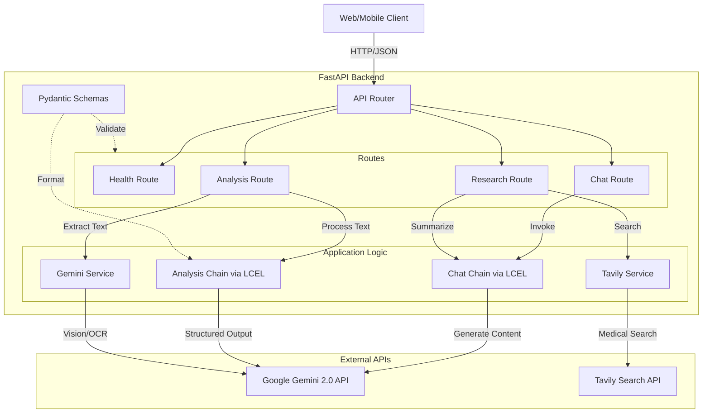
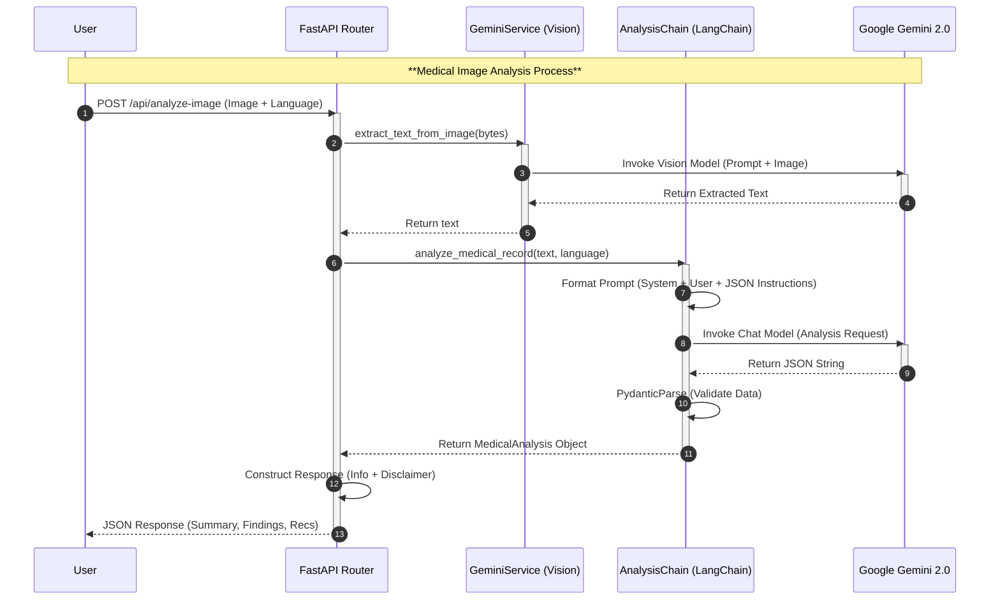
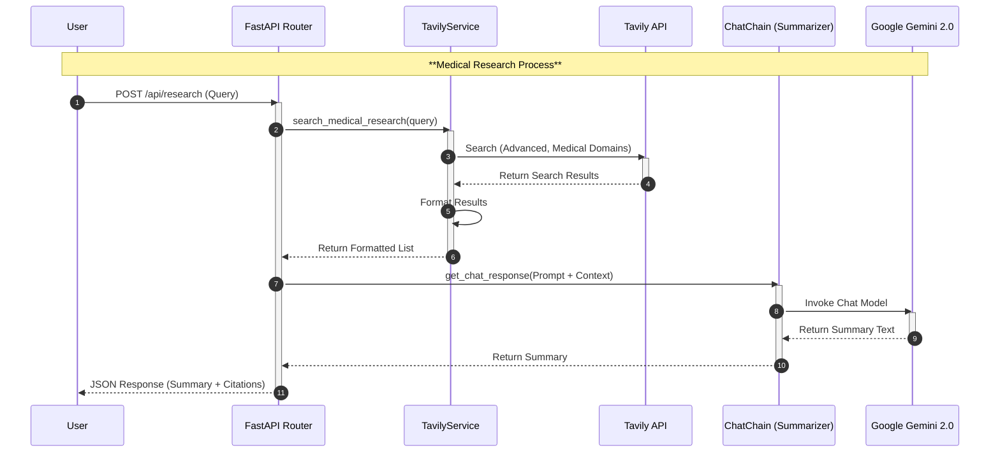

# MediCare AI Architecture & Design

## High-Level Design (HLD)

This diagram represents the high-level architecture of the **MediCare AI Backend**, illustrating how requests flow from the client through the FastAPI layer to the application services and external AI providers.

---

## End-to-End Program Flows

### 1. Medical Image Analysis Flow
This sequence demonstrates the complex flow of uploading a medical record image, extracting text using Gemini Vision, and then analyzing that text for medical insights using LangChain.

### 2. Medical Research Flow
This sequence shows how the system performs an external search for medical information and summarizes the results.

